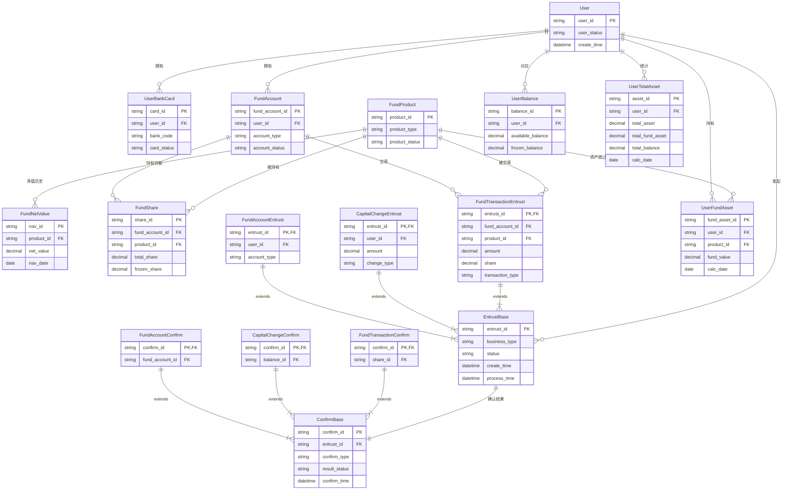

# 一、需求说明
## 一)、需求说明
请针对上述图示，绘制开放式基金交易的实体关系模型，并绘制模型关系图，并根据上述实体绘制序列图，分别使用序列图绘制创建用户信息，基金账户开发，基金申购，基金赎回，计算用户资产信息等。

假定上诉客户、基金账户、用户银行卡、用户资金表、用户份额表等相互之间的关系明确且稳定，他们存在多账户支持，多产品支持，多业务类型支持，而实际上他们之间的关联往往是通过键值进行关联，业务处理根据从键值获取对应数据，从而获取其业务类型，处理状态和其他数据字段。 业务处理则通过函数/事件来根据行主键ID、业务类型，业务数据来进行实际的委托/清算/交收等处理。请根据上述信息重新构建业务模型，重点突出本表主键和与关联表之间的主键ID，并辅以业务类型，暂时忽略业务字段。但表关系稳定后，再逐步添加和完善业务字段。请处理。谢谢。

## 二)、 实体关系手绘图


# 二、系统概要设计

实体关系模型（ER 模型）图和业务功能


---

## 一)、序列图（Sequence Diagrams）

###  1. 创建用户信息


---

### 2.  基金账户开户


---

### 3. 基金申购


---

### 4. 基金赎回


---

### 5. 计算用户资产信息


基于您的需求，我将重构业务模型，重点关注主键关联、业务类型和状态流转，实现多账户、多产品、多业务类型的支持。

## 二)、重构的业务模型ER图



## 三)、核心表结构设计及建表脚本

### 1. 基础实体表

```sql
-- 用户表 (核心实体)
CREATE TABLE User (
    user_id VARCHAR(32) PRIMARY KEY,      -- 用户ID (主键)
    user_status VARCHAR(20),              -- 用户状态
    user_type VARCHAR(20),                -- 用户类型
    create_time DATETIME,
    update_time DATETIME,
    INDEX idx_user_status (user_status)
);

-- 基金账户表 (多账户支持)
CREATE TABLE FundAccount (
    fund_account_id VARCHAR(32) PRIMARY KEY,  -- 基金账户ID (主键)
    user_id VARCHAR(32),                      -- 用户ID (外键)
    account_type VARCHAR(20),                 -- 账户类型
    account_status VARCHAR(20),               -- 账户状态
    open_date DATE,
    INDEX idx_user_account (user_id, account_status),
    FOREIGN KEY (user_id) REFERENCES User(user_id)
);

-- 基金产品表 (多产品支持)
CREATE TABLE FundProduct (
    product_id VARCHAR(32) PRIMARY KEY,   -- 产品ID (主键)
    product_code VARCHAR(20),             -- 产品代码
    product_name VARCHAR(100),
    product_type VARCHAR(20),             -- 产品类型
    product_status VARCHAR(20),           -- 产品状态
    INDEX idx_product_type_status (product_type, product_status)
);
```

### 2. 委托基类表 (支持多业务类型)

```sql
-- 委托基础表 (抽象基类)
CREATE TABLE EntrustBase (
    entrust_id VARCHAR(32) PRIMARY KEY,   -- 委托ID (主键，全局唯一)
    business_type VARCHAR(30),            -- 业务类型：ACCOUNT_OPEN, SUBSCRIBE, REDEEM等
    status VARCHAR(20),                   -- 状态：PENDING, PROCESSING, SUCCESS, FAILED
    user_id VARCHAR(32),                  -- 用户ID (冗余，便于查询)
    create_time DATETIME,
    process_time DATETIME,
    INDEX idx_business_status (business_type, status),
    INDEX idx_user_time (user_id, create_time)
);

-- 基金账户委托表 (继承EntrustBase)
CREATE TABLE FundAccountEntrust (
    entrust_id VARCHAR(32) PRIMARY KEY,   -- 委托ID (主键，也是外键)
    user_id VARCHAR(32),                  -- 用户ID
    account_type VARCHAR(20),             -- 账户类型
    request_data JSON,                    -- 请求数据
    FOREIGN KEY (entrust_id) REFERENCES EntrustBase(entrust_id),
    FOREIGN KEY (user_id) REFERENCES User(user_id)
);

-- 基金交易委托表 (继承EntrustBase)
CREATE TABLE FundTransactionEntrust (
    entrust_id VARCHAR(32) PRIMARY KEY,   -- 委托ID
    fund_account_id VARCHAR(32),          -- 基金账户ID
    product_id VARCHAR(32),               -- 产品ID
    transaction_type VARCHAR(20),         -- 交易类型：SUBSCRIBE, REDEEM
    amount DECIMAL(18, 4),                -- 交易金额
    share DECIMAL(18, 4),                 -- 交易份额
    FOREIGN KEY (entrust_id) REFERENCES EntrustBase(entrust_id),
    FOREIGN KEY (fund_account_id) REFERENCES FundAccount(fund_account_id),
    FOREIGN KEY (product_id) REFERENCES FundProduct(product_id)
);
```

### 3. 确认基类表

```sql
-- 确认基础表
CREATE TABLE ConfirmBase (
    confirm_id VARCHAR(32) PRIMARY KEY,   -- 确认ID (主键)
    entrust_id VARCHAR(32),               -- 委托ID (外键)
    confirm_type VARCHAR(20),             -- 确认类型
    result_status VARCHAR(20),            -- 结果状态
    confirm_time DATETIME,
    remark VARCHAR(500),
    FOREIGN KEY (entrust_id) REFERENCES EntrustBase(entrust_id),
    INDEX idx_entrust_confirm (entrust_id, confirm_type)
);
```

### 4. 资产相关表

```sql
-- 基金份额表 (多产品支持)
CREATE TABLE FundShare (
    share_id VARCHAR(32) PRIMARY KEY,     -- 份额ID (主键)
    fund_account_id VARCHAR(32),          -- 基金账户ID
    product_id VARCHAR(32),               -- 产品ID
    total_share DECIMAL(18, 4),           -- 总份额
    available_share DECIMAL(18, 4),       -- 可用份额
    frozen_share DECIMAL(18, 4),          -- 冻结份额
    FOREIGN KEY (fund_account_id) REFERENCES FundAccount(fund_account_id),
    FOREIGN KEY (product_id) REFERENCES FundProduct(product_id),
    UNIQUE KEY uk_account_product (fund_account_id, product_id)
);

-- 用户总资产表
CREATE TABLE UserTotalAsset (
    asset_id VARCHAR(32) PRIMARY KEY,     -- 资产ID
    user_id VARCHAR(32),                  -- 用户ID
    total_asset DECIMAL(18, 4),           -- 总资产
    total_fund_asset DECIMAL(18, 4),      -- 基金总资产
    total_balance DECIMAL(18, 4),         -- 总余额
    calc_date DATE,                       -- 计算日期
    FOREIGN KEY (user_id) REFERENCES User(user_id),
    INDEX idx_user_date (user_id, calc_date)
);
```

## 四)、 业务处理流程函数设计

### 1. 委托处理函数

```python
class EntrustProcessor:
    """委托处理器基类"""
    
    def process_entrust(self, entrust_id: str, business_type: str, data: dict):
        """处理委托通用流程"""
        # 1. 验证委托
        entrust = self.get_entrust_by_id(entrust_id)
        if not entrust:
            raise Exception(f"委托不存在: {entrust_id}")
            
        # 2. 根据业务类型分发处理
        handler = self.get_handler(business_type)
        if not handler:
            raise Exception(f"不支持的业务类型: {business_type}")
            
        # 3. 执行业务处理
        result = handler.process(entrust, data)
        
        # 4. 更新委托状态
        self.update_entrust_status(entrust_id, result.status)
        
        # 5. 生成确认记录
        confirm_id = self.create_confirm(entrust_id, result)
        
        return confirm_id
    
    def get_handler(self, business_type: str):
        """根据业务类型获取处理器"""
        handlers = {
            "ACCOUNT_OPEN": AccountOpenHandler(),
            "FUND_SUBSCRIBE": FundSubscribeHandler(),
            "FUND_REDEEM": FundRedeemHandler(),
            "CAPITAL_IN": CapitalInHandler(),
            "CAPITAL_OUT": CapitalOutHandler()
        }
        return handlers.get(business_type)
```

### 2. 具体业务处理器

```python
class FundSubscribeHandler:
    """基金申购处理器"""
    
    def process(self, entrust: dict, data: dict) -> ProcessResult:
        # 获取关联数据
        fund_account_id = entrust.get('fund_account_id')
        product_id = entrust.get('product_id')
        amount = entrust.get('amount')
        
        # 1. 检查资金
        user_id = self.get_user_id_by_account(fund_account_id)
        balance = self.get_user_balance(user_id)
        
        if balance.available_balance < amount:
            return ProcessResult.fail("余额不足")
        
        # 2. 冻结资金
        self.freeze_balance(user_id, amount)
        
        # 3. 获取净值计算份额
        nav = self.get_latest_nav(product_id)
        share = amount / nav.net_value
        
        # 4. 更新份额（预分配）
        share_id = self.prepare_share(fund_account_id, product_id, share)
        
        return ProcessResult.success({
            'share': share,
            'nav': nav.net_value,
            'share_id': share_id
        })

class FundRedeemHandler:
    """基金赎回处理器"""
    
    def process(self, entrust: dict, data: dict) -> ProcessResult:
        fund_account_id = entrust.get('fund_account_id')
        product_id = entrust.get('product_id')
        redeem_share = entrust.get('share')
        
        # 1. 检查份额
        share_info = self.get_fund_share(fund_account_id, product_id)
        if share_info.available_share < redeem_share:
            return ProcessResult.fail("可用份额不足")
        
        # 2. 冻结份额
        self.freeze_share(share_info.share_id, redeem_share)
        
        # 3. 获取净值计算金额
        nav = self.get_latest_nav(product_id)
        amount = redeem_share * nav.net_value
        
        return ProcessResult.success({
            'amount': amount,
            'nav': nav.net_value
        })
```

## 五)、查询服务设计

```python
class AssetQueryService:
    """资产查询服务"""
    
    def calculate_user_total_asset(self, user_id: str) -> dict:
        """计算用户总资产"""
        # 1. 查询资金余额
        balance = self.get_user_balance(user_id)
        
        # 2. 查询所有基金账户
        accounts = self.get_user_fund_accounts(user_id)
        
        total_fund_value = 0
        fund_assets = []
        
        # 3. 计算每个产品的基金资产
        for account in accounts:
            shares = self.get_account_shares(account.fund_account_id)
            
            for share in shares:
                # 获取最新净值
                nav = self.get_latest_nav(share.product_id)
                fund_value = share.total_share * nav.net_value
                total_fund_value += fund_value
                
                fund_assets.append({
                    'product_id': share.product_id,
                    'share': share.total_share,
                    'nav': nav.net_value,
                    'value': fund_value
                })
        
        # 4. 计算总资产
        total_asset = balance.total_balance + total_fund_value
        
        # 5. 更新资产表
        asset_id = self.update_total_asset(
            user_id=user_id,
            total_asset=total_asset,
            total_fund_asset=total_fund_value,
            total_balance=balance.total_balance
        )
        
        return {
            'asset_id': asset_id,
            'total_asset': total_asset,
            'fund_assets': fund_assets,
            'balance': balance
        }
```

## 六)、优势说明

### 1. **扩展性强**
- 基类表设计支持新业务类型的快速扩展
- 业务处理器模式支持新功能的插件式开发

### 2. **数据一致性**
- 通过主键关联确保数据完整性
- 事务处理保证业务操作的原子性

### 3. **查询性能**
- 合理的索引设计支持高效查询
- 冗余字段减少关联查询

### 4. **状态追踪**
- 清晰的委托/确认状态流转
- 完整的操作日志记录

### 5. **多维度支持**
- 多账户：一个用户多个基金账户
- 多产品：支持多种基金产品
- 多业务：申购、赎回、转换等

这个重构模型通过基类表+具体业务表的模式，实现了业务类型的灵活扩展，同时保持了数据结构的稳定性和一致性。您可以根据实际业务需求，逐步添加具体的业务字段到这个框架中。

# 三、系统详细设计

## 一)、数据表结构（Markdown格式）

### 1. 核心实体表

#### 1). 用户表 (User)
| 字段名      | 数据类型     | 主键 | 外键 | 允许空 | 默认值                                        | 说明                             |
| ----------- | ------------ | ---- | ---- | ------ | --------------------------------------------- | -------------------------------- |
| user_id     | VARCHAR(32)  | ✅    |      | ❌      |                                               | 用户ID，全局唯一                 |
| user_name   | VARCHAR(50)  |      |      | ✅      |                                               | 用户姓名                         |
| user_type   | VARCHAR(20)  |      |      | ❌      | 'PERSONAL'                                    | 用户类型：PERSONAL/INSTITUTION   |
| user_status | VARCHAR(20)  |      |      | ❌      | 'ACTIVE'                                      | 用户状态：ACTIVE/INACTIVE/FROZEN |
| identity_no | VARCHAR(30)  |      |      | ✅      |                                               | 身份证/机构代码                  |
| phone       | VARCHAR(20)  |      |      | ✅      |                                               | 手机号                           |
| email       | VARCHAR(100) |      |      | ✅      |                                               | 邮箱                             |
| create_time | DATETIME     |      |      | ❌      | CURRENT_TIMESTAMP                             | 创建时间                         |
| update_time | DATETIME     |      |      | ❌      | CURRENT_TIMESTAMP ON UPDATE CURRENT_TIMESTAMP | 更新时间                         |

#### 2). 用户银行卡表 (UserBankCard)
| 字段名      | 数据类型    | 主键 | 外键 | 允许空 | 默认值            | 说明                         |
| ----------- | ----------- | ---- | ---- | ------ | ----------------- | ---------------------------- |
| card_id     | VARCHAR(32) | ✅    |      | ❌      |                   | 银行卡ID                     |
| user_id     | VARCHAR(32) |      | ✅    | ❌      |                   | 用户ID，关联User.user_id     |
| bank_code   | VARCHAR(20) |      |      | ❌      |                   | 银行代码                     |
| bank_name   | VARCHAR(50) |      |      | ✅      |                   | 银行名称                     |
| card_no     | VARCHAR(30) |      |      | ❌      |                   | 银行卡号（加密存储）         |
| card_type   | VARCHAR(20) |      |      | ❌      | 'DEBIT'           | 卡类型：DEBIT/CREDIT         |
| card_status | VARCHAR(20) |      |      | ❌      | 'ACTIVE'          | 状态：ACTIVE/INACTIVE/FROZEN |
| bind_time   | DATETIME    |      |      | ❌      | CURRENT_TIMESTAMP | 绑定时间                     |
| is_default  | BOOLEAN     |      |      | ❌      | FALSE             | 是否默认卡                   |

#### 3). 基金账户表 (FundAccount)
| 字段名          | 数据类型    | 主键 | 外键 | 允许空 | 默认值            | 说明                             |
| --------------- | ----------- | ---- | ---- | ------ | ----------------- | -------------------------------- |
| fund_account_id | VARCHAR(32) | ✅    |      | ❌      |                   | 基金账户ID                       |
| user_id         | VARCHAR(32) |      | ✅    | ❌      |                   | 用户ID，关联User.user_id         |
| account_no      | VARCHAR(30) |      |      | ❌      |                   | 基金账户号                       |
| account_type    | VARCHAR(20) |      |      | ❌      | 'INDIVIDUAL'      | 账户类型：INDIVIDUAL/INSTITUTION |
| account_status  | VARCHAR(20) |      |      | ❌      | 'ACTIVE'          | 状态：ACTIVE/INACTIVE/FROZEN     |
| open_date       | DATE        |      |      | ❌      |                   | 开户日期                         |
| close_date      | DATE        |      |      | ✅      |                   | 销户日期                         |
| create_time     | DATETIME    |      |      | ❌      | CURRENT_TIMESTAMP | 创建时间                         |

#### 4). 基金产品表 (FundProduct)
| 字段名         | 数据类型     | 主键 | 外键 | 允许空 | 默认值            | 说明                                 |
| -------------- | ------------ | ---- | ---- | ------ | ----------------- | ------------------------------------ |
| product_id     | VARCHAR(32)  | ✅    |      | ❌      |                   | 产品ID                               |
| product_code   | VARCHAR(20)  |      |      | ❌      |                   | 产品代码                             |
| product_name   | VARCHAR(100) |      |      | ❌      |                   | 产品名称                             |
| product_type   | VARCHAR(20)  |      |      | ❌      | 'EQUITY'          | 产品类型：EQUITY/BOND/MIXED/MONETARY |
| product_status | VARCHAR(20)  |      |      | ❌      | 'ACTIVE'          | 状态：ACTIVE/INACTIVE                |
| risk_level     | VARCHAR(10)  |      |      | ❌      | 'R3'              | 风险等级：R1-R5                      |
| fund_company   | VARCHAR(50)  |      |      | ✅      |                   | 基金公司                             |
| issue_date     | DATE         |      |      | ❌      |                   | 发行日期                             |
| create_time    | DATETIME     |      |      | ❌      | CURRENT_TIMESTAMP | 创建时间                             |

#### 5). 基金单位净值表 (FundNetValue)
| 字段名          | 数据类型      | 主键 | 外键 | 允许空 | 默认值            | 说明                               |
| --------------- | ------------- | ---- | ---- | ------ | ----------------- | ---------------------------------- |
| nav_id          | VARCHAR(32)   | ✅    |      | ❌      |                   | 净值ID                             |
| product_id      | VARCHAR(32)   |      | ✅    | ❌      |                   | 产品ID，关联FundProduct.product_id |
| net_value       | DECIMAL(10,4) |      |      | ❌      |                   | 单位净值                           |
| accumulated_nav | DECIMAL(10,4) |      |      | ✅      |                   | 累计净值                           |
| nav_date        | DATE          |      |      | ❌      |                   | 净值日期                           |
| create_time     | DATETIME      |      |      | ❌      | CURRENT_TIMESTAMP | 创建时间                           |

#### 6). 用户资金余额表 (UserBalance)
| 字段名            | 数据类型      | 主键 | 外键 | 允许空 | 默认值            | 说明                     |
| ----------------- | ------------- | ---- | ---- | ------ | ----------------- | ------------------------ |
| balance_id        | VARCHAR(32)   | ✅    |      | ❌      |                   | 余额ID                   |
| user_id           | VARCHAR(32)   |      | ✅    | ❌      |                   | 用户ID，关联User.user_id |
| available_balance | DECIMAL(18,4) |      |      | ❌      | 0                 | 可用余额                 |
| frozen_balance    | DECIMAL(18,4) |      |      | ❌      | 0                 | 冻结余额                 |
| total_balance     | DECIMAL(18,4) |      |      | ❌      | 0                 | 总余额（计算字段）       |
| last_update       | DATETIME      |      |      | ❌      | CURRENT_TIMESTAMP | 最后更新时间             |

#### 7). 基金份额表 (FundShare)
| 字段名          | 数据类型      | 主键 | 外键 | 允许空 | 默认值            | 说明                                        |
| --------------- | ------------- | ---- | ---- | ------ | ----------------- | ------------------------------------------- |
| share_id        | VARCHAR(32)   | ✅    |      | ❌      |                   | 份额ID                                      |
| fund_account_id | VARCHAR(32)   |      | ✅    | ❌      |                   | 基金账户ID，关联FundAccount.fund_account_id |
| product_id      | VARCHAR(32)   |      | ✅    | ❌      |                   | 产品ID，关联FundProduct.product_id          |
| total_share     | DECIMAL(18,4) |      |      | ❌      | 0                 | 总份额                                      |
| available_share | DECIMAL(18,4) |      |      | ❌      | 0                 | 可用份额                                    |
| frozen_share    | DECIMAL(18,4) |      |      | ❌      | 0                 | 冻结份额                                    |
| last_update     | DATETIME      |      |      | ❌      | CURRENT_TIMESTAMP | 最后更新时间                                |

### 2. 业务处理表

#### 1). 委托基础表 (EntrustBase)
| 字段名        | 数据类型    | 主键 | 外键 | 允许空 | 默认值            | 说明                                                         |
| ------------- | ----------- | ---- | ---- | ------ | ----------------- | ------------------------------------------------------------ |
| entrust_id    | VARCHAR(32) | ✅    |      | ❌      |                   | 委托ID                                                       |
| business_type | VARCHAR(30) |      |      | ❌      |                   | 业务类型：ACCOUNT_OPEN/FUND_SUBSCRIBE/FUND_REDEEM/CAPITAL_IN/CAPITAL_OUT |
| status        | VARCHAR(20) |      |      | ❌      | 'PENDING'         | 状态：PENDING/PROCESSING/SUCCESS/FAILED                      |
| user_id       | VARCHAR(32) |      | ✅    | ❌      |                   | 用户ID，关联User.user_id                                     |
| request_data  | JSON        |      |      | ✅      |                   | 请求数据                                                     |
| response_data | JSON        |      |      | ✅      |                   | 响应数据                                                     |
| create_time   | DATETIME    |      |      | ❌      | CURRENT_TIMESTAMP | 创建时间                                                     |
| process_time  | DATETIME    |      |      | ✅      |                   | 处理时间                                                     |
| complete_time | DATETIME    |      |      | ✅      |                   | 完成时间                                                     |
| error_msg     | TEXT        |      |      | ✅      |                   | 错误信息                                                     |

#### 2). 基金账户委托表 (FundAccountEntrust)
| 字段名         | 数据类型    | 主键 | 外键 | 允许空 | 默认值       | 说明                               |
| -------------- | ----------- | ---- | ---- | ------ | ------------ | ---------------------------------- |
| entrust_id     | VARCHAR(32) | ✅    | ✅    | ❌      |              | 委托ID，关联EntrustBase.entrust_id |
| account_type   | VARCHAR(20) |      |      | ❌      | 'INDIVIDUAL' | 账户类型                           |
| source_channel | VARCHAR(30) |      |      | ❌      | 'WEB'        | 来源渠道：WEB/APP/BANK             |

#### 3). 基金交易委托表 (FundTransactionEntrust)
| 字段名           | 数据类型      | 主键 | 外键 | 允许空 | 默认值 | 说明                                        |
| ---------------- | ------------- | ---- | ---- | ------ | ------ | ------------------------------------------- |
| entrust_id       | VARCHAR(32)   | ✅    | ✅    | ❌      |        | 委托ID，关联EntrustBase.entrust_id          |
| fund_account_id  | VARCHAR(32)   |      | ✅    | ❌      |        | 基金账户ID，关联FundAccount.fund_account_id |
| product_id       | VARCHAR(32)   |      | ✅    | ❌      |        | 产品ID，关联FundProduct.product_id          |
| transaction_type | VARCHAR(20)   |      |      | ❌      |        | 交易类型：SUBSCRIBE/REDEEM                  |
| amount           | DECIMAL(18,4) |      |      | ✅      |        | 交易金额（申购用）                          |
| share            | DECIMAL(18,4) |      |      | ✅      |        | 交易份额（赎回用）                          |
| nav              | DECIMAL(10,4) |      |      | ✅      |        | 交易净值                                    |
| fee              | DECIMAL(18,4) |      |      | ❌      | 0      | 手续费                                      |

#### 4). 资金变动委托表 (CapitalChangeEntrust)
| 字段名         | 数据类型      | 主键 | 外键 | 允许空 | 默认值 | 说明                               |
| -------------- | ------------- | ---- | ---- | ------ | ------ | ---------------------------------- |
| entrust_id     | VARCHAR(32)   | ✅    | ✅    | ❌      |        | 委托ID，关联EntrustBase.entrust_id |
| card_id        | VARCHAR(32)   |      | ✅    | ❌      |        | 银行卡ID，关联UserBankCard.card_id |
| change_type    | VARCHAR(20)   |      |      | ❌      |        | 变动类型：IN/OUT                   |
| amount         | DECIMAL(18,4) |      |      | ❌      |        | 变动金额                           |
| third_party_no | VARCHAR(50)   |      |      | ✅      |        | 第三方流水号                       |

#### 5). 确认基础表 (ConfirmBase)
| 字段名        | 数据类型     | 主键 | 外键 | 允许空 | 默认值            | 说明                               |
| ------------- | ------------ | ---- | ---- | ------ | ----------------- | ---------------------------------- |
| confirm_id    | VARCHAR(32)  | ✅    |      | ❌      |                   | 确认ID                             |
| entrust_id    | VARCHAR(32)  |      | ✅    | ❌      |                   | 委托ID，关联EntrustBase.entrust_id |
| confirm_type  | VARCHAR(20)  |      |      | ❌      |                   | 确认类型                           |
| result_status | VARCHAR(20)  |      |      | ❌      |                   | 结果状态：SUCCESS/FAILED           |
| confirm_data  | JSON         |      |      | ✅      |                   | 确认数据                           |
| confirm_time  | DATETIME     |      |      | ❌      | CURRENT_TIMESTAMP | 确认时间                           |
| remark        | VARCHAR(500) |      |      | ✅      |                   | 备注                               |

### 3. 资产汇总表

#### 1). 用户总资产表 (UserTotalAsset)
| 字段名           | 数据类型      | 主键 | 外键 | 允许空 | 默认值            | 说明                     |
| ---------------- | ------------- | ---- | ---- | ------ | ----------------- | ------------------------ |
| asset_id         | VARCHAR(32)   | ✅    |      | ❌      |                   | 资产ID                   |
| user_id          | VARCHAR(32)   |      | ✅    | ❌      |                   | 用户ID，关联User.user_id |
| total_asset      | DECIMAL(18,4) |      |      | ❌      | 0                 | 总资产                   |
| total_fund_asset | DECIMAL(18,4) |      |      | ❌      | 0                 | 基金总资产               |
| total_balance    | DECIMAL(18,4) |      |      | ❌      | 0                 | 总余额                   |
| calc_date        | DATE          |      |      | ❌      |                   | 计算日期                 |
| create_time      | DATETIME      |      |      | ❌      | CURRENT_TIMESTAMP | 创建时间                 |

#### 2). 用户基金资产表 (UserFundAsset)
| 字段名        | 数据类型      | 主键 | 外键 | 允许空 | 默认值            | 说明                               |
| ------------- | ------------- | ---- | ---- | ------ | ----------------- | ---------------------------------- |
| fund_asset_id | VARCHAR(32)   | ✅    |      | ❌      |                   | 基金资产ID                         |
| user_id       | VARCHAR(32)   |      | ✅    | ❌      |                   | 用户ID，关联User.user_id           |
| product_id    | VARCHAR(32)   |      | ✅    | ❌      |                   | 产品ID，关联FundProduct.product_id |
| fund_share    | DECIMAL(18,4) |      |      | ❌      | 0                 | 持有份额                           |
| fund_value    | DECIMAL(18,4) |      |      | ❌      | 0                 | 基金价值                           |
| nav           | DECIMAL(10,4) |      |      | ❌      |                   | 计算净值                           |
| calc_date     | DATE          |      |      | ❌      |                   | 计算日期                           |
| create_time   | DATETIME      |      |      | ❌      | CURRENT_TIMESTAMP | 创建时间                           |

---

## 二)、基于Pandas的数据管理

```python
import pandas as pd
import numpy as np
from datetime import datetime, date
import uuid
import json
from typing import Dict, List, Optional, Tuple
import warnings
warnings.filterwarnings('ignore')

class FundDataManager:
    """基金数据管理器 - 基于Pandas的内存数据管理"""
    
    def __init__(self):
        self.tables = {}
        self._initialize_tables()
        
    def _initialize_tables(self):
        """初始化所有数据表"""
        # 核心实体表
        self.tables['User'] = pd.DataFrame(columns=[
            'user_id', 'user_name', 'user_type', 'user_status', 
            'identity_no', 'phone', 'email', 'create_time', 'update_time'
        ])
        
        self.tables['UserBankCard'] = pd.DataFrame(columns=[
            'card_id', 'user_id', 'bank_code', 'bank_name', 'card_no',
            'card_type', 'card_status', 'bind_time', 'is_default'
        ])
        
        self.tables['FundAccount'] = pd.DataFrame(columns=[
            'fund_account_id', 'user_id', 'account_no', 'account_type',
            'account_status', 'open_date', 'close_date', 'create_time'
        ])
        
        self.tables['FundProduct'] = pd.DataFrame(columns=[
            'product_id', 'product_code', 'product_name', 'product_type',
            'product_status', 'risk_level', 'fund_company', 'issue_date', 'create_time'
        ])
        
        self.tables['FundNetValue'] = pd.DataFrame(columns=[
            'nav_id', 'product_id', 'net_value', 'accumulated_nav',
            'nav_date', 'create_time'
        ])
        
        self.tables['UserBalance'] = pd.DataFrame(columns=[
            'balance_id', 'user_id', 'available_balance', 'frozen_balance',
            'total_balance', 'last_update'
        ])
        
        self.tables['FundShare'] = pd.DataFrame(columns=[
            'share_id', 'fund_account_id', 'product_id', 'total_share',
            'available_share', 'frozen_share', 'last_update'
        ])
        
        # 业务处理表
        self.tables['EntrustBase'] = pd.DataFrame(columns=[
            'entrust_id', 'business_type', 'status', 'user_id',
            'request_data', 'response_data', 'create_time', 'process_time',
            'complete_time', 'error_msg'
        ])
        
        self.tables['FundAccountEntrust'] = pd.DataFrame(columns=[
            'entrust_id', 'account_type', 'source_channel'
        ])
        
        self.tables['FundTransactionEntrust'] = pd.DataFrame(columns=[
            'entrust_id', 'fund_account_id', 'product_id', 'transaction_type',
            'amount', 'share', 'nav', 'fee'
        ])
        
        # 资产汇总表
        self.tables['UserTotalAsset'] = pd.DataFrame(columns=[
            'asset_id', 'user_id', 'total_asset', 'total_fund_asset',
            'total_balance', 'calc_date', 'create_time'
        ])
        
        self.tables['UserFundAsset'] = pd.DataFrame(columns=[
            'fund_asset_id', 'user_id', 'product_id', 'fund_share',
            'fund_value', 'nav', 'calc_date', 'create_time'
        ])
        
        # 加载初始测试数据
        self._load_sample_data()
    
    def _load_sample_data(self):
        """加载示例数据"""
        # 创建测试用户
        user_id = 'USER_' + str(uuid.uuid4())[:8]
        self.add_user(
            user_id=user_id,
            user_name='测试用户',
            user_type='PERSONAL',
            identity_no='320101199001011234',
            phone='13800138000',
            email='test@example.com'
        )
        
        # 创建基金产品
        product_id = 'PROD_' + str(uuid.uuid4())[:8]
        self.add_product(
            product_id=product_id,
            product_code='001234',
            product_name='测试基金',
            product_type='EQUITY',
            risk_level='R3',
            fund_company='测试基金公司'
        )
        
        # 添加净值
        self.add_nav(
            product_id=product_id,
            net_value=1.2345,
            accumulated_nav=1.5678,
            nav_date=date.today()
        )
        
        # 初始化用户余额
        self.update_user_balance(user_id, 100000.00)
        
        print(f"初始化完成: 用户ID={user_id}, 产品ID={product_id}")
    
    def _generate_id(self, prefix=''):
        """生成唯一ID"""
        return prefix + str(uuid.uuid4()).replace('-', '')
    
    def add_user(self, **kwargs):
        """添加用户"""
        user_id = kwargs.get('user_id', self._generate_id('USER_'))
        now = datetime.now()
        
        user_data = {
            'user_id': user_id,
            'user_name': kwargs.get('user_name', ''),
            'user_type': kwargs.get('user_type', 'PERSONAL'),
            'user_status': kwargs.get('user_status', 'ACTIVE'),
            'identity_no': kwargs.get('identity_no', ''),
            'phone': kwargs.get('phone', ''),
            'email': kwargs.get('email', ''),
            'create_time': now,
            'update_time': now
        }
        
        df = self.tables['User']
        df.loc[len(df)] = user_data
        
        # 初始化用户余额
        self.update_user_balance(user_id, 0)
        
        return user_id
    
    def add_product(self, **kwargs):
        """添加基金产品"""
        product_id = kwargs.get('product_id', self._generate_id('PROD_'))
        now = datetime.now()
        
        product_data = {
            'product_id': product_id,
            'product_code': kwargs.get('product_code', ''),
            'product_name': kwargs.get('product_name', ''),
            'product_type': kwargs.get('product_type', 'EQUITY'),
            'product_status': kwargs.get('product_status', 'ACTIVE'),
            'risk_level': kwargs.get('risk_level', 'R3'),
            'fund_company': kwargs.get('fund_company', ''),
            'issue_date': kwargs.get('issue_date', date.today()),
            'create_time': now
        }
        
        df = self.tables['FundProduct']
        df.loc[len(df)] = product_data
        
        return product_id
    
    def add_nav(self, product_id, net_value, accumulated_nav=None, nav_date=None):
        """添加基金净值"""
        nav_id = self._generate_id('NAV_')
        nav_date = nav_date or date.today()
        accumulated_nav = accumulated_nav or net_value
        
        nav_data = {
            'nav_id': nav_id,
            'product_id': product_id,
            'net_value': float(net_value),
            'accumulated_nav': float(accumulated_nav),
            'nav_date': nav_date,
            'create_time': datetime.now()
        }
        
        df = self.tables['FundNetValue']
        df.loc[len(df)] = nav_data
        
        return nav_id
    
    def update_user_balance(self, user_id, available_balance, frozen_balance=0):
        """更新用户余额"""
        df = self.tables['UserBalance']
        
        # 查找用户余额记录
        user_balance = df[df['user_id'] == user_id]
        
        if len(user_balance) == 0:
            # 创建新记录
            balance_id = self._generate_id('BAL_')
            balance_data = {
                'balance_id': balance_id,
                'user_id': user_id,
                'available_balance': float(available_balance),
                'frozen_balance': float(frozen_balance),
                'total_balance': float(available_balance + frozen_balance),
                'last_update': datetime.now()
            }
            df.loc[len(df)] = balance_data
        else:
            # 更新现有记录
            idx = user_balance.index[0]
            df.at[idx, 'available_balance'] = float(available_balance)
            df.at[idx, 'frozen_balance'] = float(frozen_balance)
            df.at[idx, 'total_balance'] = float(available_balance + frozen_balance)
            df.at[idx, 'last_update'] = datetime.now()
    
    def get_user_balance(self, user_id):
        """获取用户余额"""
        df = self.tables['UserBalance']
        balance = df[df['user_id'] == user_id]
        
        if len(balance) == 0:
            return None
        
        return balance.iloc[0].to_dict()
    
    def open_fund_account(self, user_id, account_type='INDIVIDUAL'):
        """开户"""
        # 检查用户是否存在
        user_df = self.tables['User']
        if user_id not in user_df['user_id'].values:
            raise ValueError(f"用户不存在: {user_id}")
        
        # 创建基金账户
        account_id = self._generate_id('ACC_')
        now = datetime.now()
        
        account_data = {
            'fund_account_id': account_id,
            'user_id': user_id,
            'account_no': f'F{now.strftime("%Y%m%d")}{str(uuid.uuid4())[:8]}',
            'account_type': account_type,
            'account_status': 'ACTIVE',
            'open_date': date.today(),
            'create_time': now
        }
        
        df = self.tables['FundAccount']
        df.loc[len(df)] = account_data
        
        return account_id
    
    def subscribe_fund(self, fund_account_id, product_id, amount):
        """申购基金"""
        # 获取账户信息
        account_df = self.tables['FundAccount']
        account = account_df[account_df['fund_account_id'] == fund_account_id]
        
        if len(account) == 0:
            raise ValueError(f"基金账户不存在: {fund_account_id}")
        
        user_id = account.iloc[0]['user_id']
        
        # 获取最新净值
        nav_df = self.tables['FundNetValue']
        nav_records = nav_df[nav_df['product_id'] == product_id]
        
        if len(nav_records) == 0:
            raise ValueError(f"基金产品无净值数据: {product_id}")
        
        # 获取最新净值（按日期排序）
        latest_nav = nav_records.sort_values('nav_date', ascending=False).iloc[0]
        nav_value = latest_nav['net_value']
        
        # 计算份额
        share = amount / nav_value
        
        # 检查用户余额
        balance = self.get_user_balance(user_id)
        if balance['available_balance'] < amount:
            raise ValueError(f"余额不足: 可用余额{balance['available_balance']}, 申购金额{amount}")
        
        # 冻结资金
        new_available = balance['available_balance'] - amount
        new_frozen = balance['frozen_balance'] + amount
        self.update_user_balance(user_id, new_available, new_frozen)
        
        # 记录委托
        entrust_id = self._create_entrust(
            business_type='FUND_SUBSCRIBE',
            user_id=user_id,
            request_data={
                'fund_account_id': fund_account_id,
                'product_id': product_id,
                'amount': amount,
                'nav': nav_value,
                'share': share
            }
        )
        
        # 记录交易委托详情
        trans_data = {
            'entrust_id': entrust_id,
            'fund_account_id': fund_account_id,
            'product_id': product_id,
            'transaction_type': 'SUBSCRIBE',
            'amount': float(amount),
            'share': float(share),
            'nav': float(nav_value),
            'fee': 0.0
        }
        
        df = self.tables['FundTransactionEntrust']
        df.loc[len(df)] = trans_data
        
        # 更新委托状态为成功
        self._update_entrust_status(entrust_id, 'SUCCESS', {
            'share': share,
            'nav': nav_value,
            'trade_time': datetime.now().isoformat()
        })
        
        # 解冻资金并增加份额
        self._process_subscribe_confirmation(
            entrust_id, fund_account_id, product_id, share, amount
        )
        
        return {
            'entrust_id': entrust_id,
            'fund_account_id': fund_account_id,
            'product_id': product_id,
            'amount': amount,
            'share': share,
            'nav': nav_value
        }
    
    def redeem_fund(self, fund_account_id, product_id, share):
        """赎回基金"""
        # 获取账户信息
        account_df = self.tables['FundAccount']
        account = account_df[account_df['fund_account_id'] == fund_account_id]
        
        if len(account) == 0:
            raise ValueError(f"基金账户不存在: {fund_account_id}")
        
        user_id = account.iloc[0]['user_id']
        
        # 检查份额
        share_df = self.tables['FundShare']
        share_record = share_df[
            (share_df['fund_account_id'] == fund_account_id) & 
            (share_df['product_id'] == product_id)
        ]
        
        if len(share_record) == 0 or share_record.iloc[0]['available_share'] < share:
            raise ValueError(f"可用份额不足: 请求赎回{share}份")
        
        # 获取最新净值
        nav_df = self.tables['FundNetValue']
        nav_records = nav_df[nav_df['product_id'] == product_id]
        
        if len(nav_records) == 0:
            raise ValueError(f"基金产品无净值数据: {product_id}")
        
        latest_nav = nav_records.sort_values('nav_date', ascending=False).iloc[0]
        nav_value = latest_nav['net_value']
        
        # 计算赎回金额
        amount = share * nav_value
        
        # 冻结份额
        idx = share_record.index[0]
        share_df.at[idx, 'available_share'] -= share
        share_df.at[idx, 'frozen_share'] += share
        share_df.at[idx, 'last_update'] = datetime.now()
        
        # 记录委托
        entrust_id = self._create_entrust(
            business_type='FUND_REDEEM',
            user_id=user_id,
            request_data={
                'fund_account_id': fund_account_id,
                'product_id': product_id,
                'share': share,
                'nav': nav_value,
                'amount': amount
            }
        )
        
        # 记录交易委托详情
        trans_data = {
            'entrust_id': entrust_id,
            'fund_account_id': fund_account_id,
            'product_id': product_id,
            'transaction_type': 'REDEEM',
            'amount': float(amount),
            'share': float(share),
            'nav': float(nav_value),
            'fee': 0.0
        }
        
        df = self.tables['FundTransactionEntrust']
        df.loc[len(df)] = trans_data
        
        # 更新委托状态为成功
        self._update_entrust_status(entrust_id, 'SUCCESS', {
            'amount': amount,
            'nav': nav_value,
            'trade_time': datetime.now().isoformat()
        })
        
        # 解冻份额并增加资金
        self._process_redeem_confirmation(
            entrust_id, user_id, fund_account_id, product_id, share, amount
        )
        
        return {
            'entrust_id': entrust_id,
            'fund_account_id': fund_account_id,
            'product_id': product_id,
            'share': share,
            'amount': amount,
            'nav': nav_value
        }
    
    def _create_entrust(self, business_type, user_id, request_data):
        """创建委托记录"""
        entrust_id = self._generate_id('ENT_')
        now = datetime.now()
        
        entrust_data = {
            'entrust_id': entrust_id,
            'business_type': business_type,
            'status': 'PENDING',
            'user_id': user_id,
            'request_data': json.dumps(request_data, ensure_ascii=False),
            'response_data': None,
            'create_time': now,
            'process_time': now,
            'complete_time': None,
            'error_msg': None
        }
        
        df = self.tables['EntrustBase']
        df.loc[len(df)] = entrust_data
        
        return entrust_id
    
    def _update_entrust_status(self, entrust_id, status, response_data=None):
        """更新委托状态"""
        df = self.tables['EntrustBase']
        entrust = df[df['entrust_id'] == entrust_id]
        
        if len(entrust) == 0:
            raise ValueError(f"委托不存在: {entrust_id}")
        
        idx = entrust.index[0]
        df.at[idx, 'status'] = status
        
        if response_data:
            df.at[idx, 'response_data'] = json.dumps(response_data, ensure_ascii=False)
        
        if status in ['SUCCESS', 'FAILED']:
            df.at[idx, 'complete_time'] = datetime.now()
    
    def _process_subscribe_confirmation(self, entrust_id, fund_account_id, product_id, share, amount):
        """处理申购确认"""
        # 更新份额
        share_df = self.tables['FundShare']
        share_record = share_df[
            (share_df['fund_account_id'] == fund_account_id) & 
            (share_df['product_id'] == product_id)
        ]
        
        if len(share_record) == 0:
            # 创建新份额记录
            share_id = self._generate_id('SHARE_')
            share_data = {
                'share_id': share_id,
                'fund_account_id': fund_account_id,
                'product_id': product_id,
                'total_share': float(share),
                'available_share': float(share),
                'frozen_share': 0.0,
                'last_update': datetime.now()
            }
            share_df.loc[len(share_df)] = share_data
        else:
            # 更新现有份额记录
            idx = share_record.index[0]
            share_df.at[idx, 'total_share'] += share
            share_df.at[idx, 'available_share'] += share
            share_df.at[idx, 'last_update'] = datetime.now()
        
        # 获取用户ID
        account_df = self.tables['FundAccount']
        account = account_df[account_df['fund_account_id'] == fund_account_id]
        user_id = account.iloc[0]['user_id']
        
        # 解冻资金
        balance = self.get_user_balance(user_id)
        new_frozen = balance['frozen_balance'] - amount
        self.update_user_balance(user_id, balance['available_balance'], new_frozen)
        
        # 重新计算资产
        self.calculate_user_assets(user_id)
    
    def _process_redeem_confirmation(self, entrust_id, user_id, fund_account_id, product_id, share, amount):
        """处理赎回确认"""
        # 更新份额
        share_df = self.tables['FundShare']
        share_record = share_df[
            (share_df['fund_account_id'] == fund_account_id) & 
            (share_df['product_id'] == product_id)
        ]
        
        if len(share_record) > 0:
            idx = share_record.index[0]
            share_df.at[idx, 'total_share'] -= share
            share_df.at[idx, 'frozen_share'] -= share
            share_df.at[idx, 'last_update'] = datetime.now()
        
        # 增加用户资金
        balance = self.get_user_balance(user_id)
        new_available = balance['available_balance'] + amount
        self.update_user_balance(user_id, new_available, balance['frozen_balance'])
        
        # 重新计算资产
        self.calculate_user_assets(user_id)
    
    def calculate_user_assets(self, user_id):
        """计算用户资产"""
        # 获取用户余额
        balance = self.get_user_balance(user_id)
        if not balance:
            return None
        
        total_balance = balance['total_balance']
        
        # 获取用户所有基金账户
        account_df = self.tables['FundAccount']
        user_accounts = account_df[account_df['user_id'] == user_id]
        
        total_fund_value = 0.0
        fund_assets = []
        
        # 计算每个产品的基金资产
        for _, account in user_accounts.iterrows():
            fund_account_id = account['fund_account_id']
            
            # 获取该账户的所有份额
            share_df = self.tables['FundShare']
            shares = share_df[share_df['fund_account_id'] == fund_account_id]
            
            for _, share in shares.iterrows():
                product_id = share['product_id']
                
                # 获取最新净值
                nav_df = self.tables['FundNetValue']
                nav_records = nav_df[nav_df['product_id'] == product_id]
                
                if len(nav_records) > 0:
                    latest_nav = nav_records.sort_values('nav_date', ascending=False).iloc[0]
                    nav_value = latest_nav['net_value']
                    
                    # 计算基金价值
                    fund_value = share['total_share'] * nav_value
                    total_fund_value += fund_value
                    
                    # 记录基金资产明细
                    fund_assets.append({
                        'product_id': product_id,
                        'share': share['total_share'],
                        'nav': nav_value,
                        'value': fund_value
                    })
        
        # 计算总资产
        total_asset = total_balance + total_fund_value
        
        # 更新用户总资产表
        asset_id = self._generate_id('ASSET_')
        now = datetime.now()
        
        asset_data = {
            'asset_id': asset_id,
            'user_id': user_id,
            'total_asset': float(total_asset),
            'total_fund_asset': float(total_fund_value),
            'total_balance': float(total_balance),
            'calc_date': date.today(),
            'create_time': now
        }
        
        asset_df = self.tables['UserTotalAsset']
        asset_df.loc[len(asset_df)] = asset_data
        
        # 更新用户基金资产表
        for fund_asset in fund_assets:
            fund_asset_id = self._generate_id('FA_')
            
            fund_asset_data = {
                'fund_asset_id': fund_asset_id,
                'user_id': user_id,
                'product_id': fund_asset['product_id'],
                'fund_share': float(fund_asset['share']),
                'fund_value': float(fund_asset['value']),
                'nav': float(fund_asset['nav']),
                'calc_date': date.today(),
                'create_time': now
            }
            
            fund_asset_df = self.tables['UserFundAsset']
            fund_asset_df.loc[len(fund_asset_df)] = fund_asset_data
        
        return {
            'user_id': user_id,
            'total_asset': total_asset,
            'total_fund_asset': total_fund_value,
            'total_balance': total_balance,
            'fund_assets': fund_assets,
            'calc_date': date.today()
        }
    
    def get_user_assets(self, user_id):
        """获取用户资产"""
        # 计算最新资产
        return self.calculate_user_assets(user_id)
    
    def get_table_info(self, table_name):
        """获取表信息"""
        if table_name not in self.tables:
            return f"表不存在: {table_name}"
        
        df = self.tables[table_name]
        info = {
            'table_name': table_name,
            'row_count': len(df),
            'column_count': len(df.columns),
            'columns': list(df.columns),
            'sample_data': df.head(5).to_dict('records') if len(df) > 0 else []
        }
        
        return info
    
    def export_to_csv(self, folder_path='./data'):
        """导出数据到CSV文件"""
        import os
        os.makedirs(folder_path, exist_ok=True)
        
        for table_name, df in self.tables.items():
            file_path = os.path.join(folder_path, f'{table_name}.csv')
            df.to_csv(file_path, index=False, encoding='utf-8-sig')
            print(f"已导出: {file_path}")

# 示例使用
def demo_usage():
    """演示使用方法"""
    print("=== 基金数据管理器演示 ===\n")
    
    # 初始化管理器
    manager = FundDataManager()
    
    # 获取用户ID（从初始化数据中）
    user_df = manager.tables['User']
    user_id = user_df.iloc[0]['user_id']
    
    print(f"1. 当前用户: {user_id}")
    
    # 开户
    account_id = manager.open_fund_account(user_id)
    print(f"2. 开户成功: {account_id}")
    
    # 获取产品ID
    product_df = manager.tables['FundProduct']
    product_id = product_df.iloc[0]['product_id']
    
    # 申购基金
    try:
        subscribe_result = manager.subscribe_fund(account_id, product_id, 10000.00)
        print(f"3. 申购成功: {subscribe_result['share']:.2f}份, 净值: {subscribe_result['nav']:.4f}")
    except ValueError as e:
        print(f"3. 申购失败: {e}")
    
    # 查询资产
    assets = manager.get_user_assets(user_id)
    if assets:
        print(f"4. 用户资产: 总资产={assets['total_asset']:.2f}, "
              f"基金资产={assets['total_fund_asset']:.2f}, "
              f"余额={assets['total_balance']:.2f}")
    
    # 赎回基金
    try:
        redeem_result = manager.redeem_fund(account_id, product_id, 2000.00)
        print(f"5. 赎回成功: 赎回金额={redeem_result['amount']:.2f}, 份额={redeem_result['share']:.2f}")
    except ValueError as e:
        print(f"5. 赎回失败: {e}")
    
    # 再次查询资产
    assets = manager.get_user_assets(user_id)
    if assets:
        print(f"6. 赎回后资产: 总资产={assets['total_asset']:.2f}, "
              f"基金资产={assets['total_fund_asset']:.2f}, "
              f"余额={assets['total_balance']:.2f}")
    
    # 显示表信息
    print(f"\n7. 数据表信息:")
    for table_name in ['User', 'FundAccount', 'FundShare', 'UserBalance', 'UserTotalAsset']:
        info = manager.get_table_info(table_name)
        print(f"   - {table_name}: {info['row_count']}行记录")
    
    # 导出数据
    # manager.export_to_csv()
    
    return manager

if __name__ == "__main__":
    demo_usage()
```

---

# 四、微服务RESTful API设计

```python
# fund_service.py
from fastapi import FastAPI, HTTPException, Depends, status
from fastapi.security import HTTPBearer, HTTPAuthorizationCredentials
from pydantic import BaseModel, Field
from typing import Optional, List, Dict, Any
import uvicorn
from datetime import date
import json
from fund_data_manager import FundDataManager
import logging

# 配置日志
logging.basicConfig(level=logging.INFO)
logger = logging.getLogger(__name__)

# 初始化FastAPI应用
app = FastAPI(
    title="基金交易微服务",
    description="开放式基金交易系统微服务API",
    version="1.0.0"
)

# 安全认证
security = HTTPBearer()

# 全局数据管理器
data_manager = FundDataManager()

# 数据模型
class UserCreateRequest(BaseModel):
    """用户创建请求"""
    user_name: str = Field(..., min_length=2, max_length=50)
    user_type: str = Field("PERSONAL", regex="^(PERSONAL|INSTITUTION)$")
    identity_no: str = Field(..., min_length=15, max_length=30)
    phone: Optional[str] = None
    email: Optional[str] = None

class FundAccountOpenRequest(BaseModel):
    """基金账户开户请求"""
    user_id: str
    account_type: str = Field("INDIVIDUAL", regex="^(INDIVIDUAL|INSTITUTION)$")

class FundSubscribeRequest(BaseModel):
    """基金申购请求"""
    fund_account_id: str
    product_id: str
    amount: float = Field(..., gt=0)

class FundRedeemRequest(BaseModel):
    """基金赎回请求"""
    fund_account_id: str
    product_id: str
    share: float = Field(..., gt=0)

class ProductCreateRequest(BaseModel):
    """产品创建请求"""
    product_code: str
    product_name: str
    product_type: str = Field("EQUITY", regex="^(EQUITY|BOND|MIXED|MONETARY)$")
    risk_level: str = Field("R3", regex="^(R1|R2|R3|R4|R5)$")
    fund_company: str

class NavCreateRequest(BaseModel):
    """净值创建请求"""
    product_id: str
    net_value: float = Field(..., gt=0)
    accumulated_nav: Optional[float] = None
    nav_date: Optional[date] = None

class ResponseModel(BaseModel):
    """通用响应模型"""
    code: int = 0
    message: str = "success"
    data: Optional[Any] = None

# 辅助函数
def verify_token(credentials: HTTPAuthorizationCredentials = Depends(security)):
    """验证Token（简化版）"""
    # 在实际系统中，这里应该验证JWT或其他认证方式
    token = credentials.credentials
    # 简单模拟认证
    if token != "demo_token_2025":
        raise HTTPException(
            status_code=status.HTTP_401_UNAUTHORIZED,
            detail="无效的认证令牌"
        )
    return token

def handle_exception(e: Exception, operation: str):
    """处理异常"""
    logger.error(f"{operation}失败: {str(e)}")
    raise HTTPException(
        status_code=status.HTTP_400_BAD_REQUEST,
        detail=f"{operation}失败: {str(e)}"
    )

# API端点
@app.get("/")
async def root():
    """根端点"""
    return {
        "service": "基金交易微服务",
        "version": "1.0.0",
        "status": "运行中"
    }

@app.post("/api/v1/users", response_model=ResponseModel)
async def create_user(
    request: UserCreateRequest,
    token: str = Depends(verify_token)
):
    """创建用户"""
    try:
        user_id = data_manager.add_user(**request.dict())
        logger.info(f"用户创建成功: {user_id}")
        
        return ResponseModel(
            data={
                "user_id": user_id,
                "user_name": request.user_name,
                "user_type": request.user_type
            }
        )
    except Exception as e:
        handle_exception(e, "创建用户")

@app.get("/api/v1/users/{user_id}", response_model=ResponseModel)
async def get_user(
    user_id: str,
    token: str = Depends(verify_token)
):
    """获取用户信息"""
    try:
        user_df = data_manager.tables['User']
        user = user_df[user_df['user_id'] == user_id]
        
        if len(user) == 0:
            raise HTTPException(
                status_code=status.HTTP_404_NOT_FOUND,
                detail=f"用户不存在: {user_id}"
            )
        
        user_data = user.iloc[0].to_dict()
        return ResponseModel(data=user_data)
    except HTTPException:
        raise
    except Exception as e:
        handle_exception(e, "获取用户信息")

@app.post("/api/v1/accounts/open", response_model=ResponseModel)
async def open_fund_account(
    request: FundAccountOpenRequest,
    token: str = Depends(verify_token)
):
    """开通基金账户"""
    try:
        account_id = data_manager.open_fund_account(
            request.user_id,
            request.account_type
        )
        
        logger.info(f"基金账户开通成功: {account_id}")
        
        return ResponseModel(
            data={
                "fund_account_id": account_id,
                "user_id": request.user_id,
                "account_type": request.account_type
            }
        )
    except Exception as e:
        handle_exception(e, "开通基金账户")

@app.post("/api/v1/funds/subscribe", response_model=ResponseModel)
async def subscribe_fund(
    request: FundSubscribeRequest,
    token: str = Depends(verify_token)
):
    """申购基金"""
    try:
        result = data_manager.subscribe_fund(
            request.fund_account_id,
            request.product_id,
            request.amount
        )
        
        logger.info(f"基金申购成功: {request.fund_account_id}, 金额: {request.amount}")
        
        return ResponseModel(data=result)
    except ValueError as e:
        raise HTTPException(
            status_code=status.HTTP_400_BAD_REQUEST,
            detail=str(e)
        )
    except Exception as e:
        handle_exception(e, "申购基金")

@app.post("/api/v1/funds/redeem", response_model=ResponseModel)
async def redeem_fund(
    request: FundRedeemRequest,
    token: str = Depends(verify_token)
):
    """赎回基金"""
    try:
        result = data_manager.redeem_fund(
            request.fund_account_id,
            request.product_id,
            request.share
        )
        
        logger.info(f"基金赎回成功: {request.fund_account_id}, 份额: {request.share}")
        
        return ResponseModel(data=result)
    except ValueError as e:
        raise HTTPException(
            status_code=status.HTTP_400_BAD_REQUEST,
            detail=str(e)
        )
    except Exception as e:
        handle_exception(e, "赎回基金")

@app.get("/api/v1/assets/{user_id}", response_model=ResponseModel)
async def get_user_assets(
    user_id: str,
    token: str = Depends(verify_token)
):
    """获取用户资产"""
    try:
        assets = data_manager.get_user_assets(user_id)
        
        if not assets:
            raise HTTPException(
                status_code=status.HTTP_404_NOT_FOUND,
                detail=f"用户资产不存在: {user_id}"
            )
        
        return ResponseModel(data=assets)
    except HTTPException:
        raise
    except Exception as e:
        handle_exception(e, "获取用户资产")

@app.get("/api/v1/products", response_model=ResponseModel)
async def get_products(
    product_type: Optional[str] = None,
    token: str = Depends(verify_token)
):
    """获取基金产品列表"""
    try:
        product_df = data_manager.tables['FundProduct']
        
        if product_type:
            products = product_df[product_df['product_type'] == product_type]
        else:
            products = product_df
        
        # 获取每个产品的最新净值
        result = []
        for _, product in products.iterrows():
            product_id = product['product_id']
            
            # 获取最新净值
            nav_df = data_manager.tables['FundNetValue']
            nav_records = nav_df[nav_df['product_id'] == product_id]
            
            latest_nav = None
            if len(nav_records) > 0:
                latest_nav_record = nav_records.sort_values('nav_date', ascending=False).iloc[0]
                latest_nav = {
                    'net_value': latest_nav_record['net_value'],
                    'accumulated_nav': latest_nav_record['accumulated_nav'],
                    'nav_date': latest_nav_record['nav_date'].strftime('%Y-%m-%d')
                }
            
            product_data = product.to_dict()
            product_data['latest_nav'] = latest_nav
            result.append(product_data)
        
        return ResponseModel(data=result)
    except Exception as e:
        handle_exception(e, "获取基金产品")

@app.post("/api/v1/products", response_model=ResponseModel)
async def create_product(
    request: ProductCreateRequest,
    token: str = Depends(verify_token)
):
    """创建基金产品"""
    try:
        product_id = data_manager.add_product(**request.dict())
        
        logger.info(f"基金产品创建成功: {product_id}")
        
        return ResponseModel(
            data={
                "product_id": product_id,
                "product_name": request.product_name,
                "product_type": request.product_type
            }
        )
    except Exception as e:
        handle_exception(e, "创建基金产品")

@app.post("/api/v1/nav", response_model=ResponseModel)
async def create_nav(
    request: NavCreateRequest,
    token: str = Depends(verify_token)
):
    """创建基金净值"""
    try:
        nav_id = data_manager.add_nav(**request.dict())
        
        logger.info(f"基金净值创建成功: {nav_id}")
        
        return ResponseModel(
            data={
                "nav_id": nav_id,
                "product_id": request.product_id,
                "net_value": request.net_value,
                "nav_date": request.nav_date or date.today()
            }
        )
    except Exception as e:
        handle_exception(e, "创建基金净值")

@app.get("/api/v1/health")
async def health_check():
    """健康检查"""
    return {"status": "healthy", "timestamp": datetime.now().isoformat()}

# 启动服务
if __name__ == "__main__":
    uvicorn.run(
        "fund_service:app",
        host="0.0.0.0",
        port=8000,
        reload=True,
        log_level="info"
    )
```

---

# 五、客户端封装

```python
# fund_client.py
import requests
import json
from typing import Optional, Dict, Any, List
from datetime import datetime
import logging

logging.basicConfig(level=logging.INFO)
logger = logging.getLogger(__name__)

class FundClient:
    """基金交易客户端"""
    
    def __init__(self, base_url: str = "http://localhost:8000", token: str = "demo_token_2025"):
        """
        初始化客户端
        
        Args:
            base_url: 微服务基础URL
            token: 认证令牌
        """
        self.base_url = base_url.rstrip('/')
        self.token = token
        self.headers = {
            "Authorization": f"Bearer {token}",
            "Content-Type": "application/json"
        }
        
        # 测试连接
        self._test_connection()
    
    def _test_connection(self):
        """测试服务连接"""
        try:
            response = requests.get(f"{self.base_url}/", timeout=5)
            if response.status_code == 200:
                logger.info(f"连接成功: {response.json()}")
            else:
                logger.warning(f"服务连接异常: {response.status_code}")
        except Exception as e:
            logger.error(f"无法连接到服务: {e}")
            raise
    
    def _request(self, method: str, endpoint: str, **kwargs) -> Dict[str, Any]:
        """发送HTTP请求"""
        url = f"{self.base_url}{endpoint}"
        
        try:
            response = requests.request(
                method=method,
                url=url,
                headers=self.headers,
                **kwargs
            )
            
            # 处理响应
            if response.status_code == 200:
                result = response.json()
                if result.get('code') == 0:
                    return result.get('data', {})
                else:
                    raise Exception(f"业务错误: {result.get('message')}")
            else:
                error_detail = response.json().get('detail', '未知错误')
                raise Exception(f"HTTP错误 {response.status_code}: {error_detail}")
                
        except requests.exceptions.RequestException as e:
            logger.error(f"请求失败: {e}")
            raise
        except Exception as e:
            logger.error(f"处理响应失败: {e}")
            raise
    
    def create_user(self, user_name: str, identity_no: str, **kwargs) -> str:
        """
        创建用户
        
        Args:
            user_name: 用户姓名
            identity_no: 身份证号
            **kwargs: 其他参数
            
        Returns:
            用户ID
        """
        data = {
            "user_name": user_name,
            "identity_no": identity_no,
            **kwargs
        }
        
        result = self._request("POST", "/api/v1/users", json=data)
        user_id = result.get('user_id')
        logger.info(f"用户创建成功: {user_id}")
        return user_id
    
    def get_user(self, user_id: str) -> Dict[str, Any]:
        """
        获取用户信息
        
        Args:
            user_id: 用户ID
            
        Returns:
            用户信息
        """
        result = self._request("GET", f"/api/v1/users/{user_id}")
        return result
    
    def open_fund_account(self, user_id: str, account_type: str = "INDIVIDUAL") -> str:
        """
        开通基金账户
        
        Args:
            user_id: 用户ID
            account_type: 账户类型
            
        Returns:
            基金账户ID
        """
        data = {
            "user_id": user_id,
            "account_type": account_type
        }
        
        result = self._request("POST", "/api/v1/accounts/open", json=data)
        account_id = result.get('fund_account_id')
        logger.info(f"基金账户开通成功: {account_id}")
        return account_id
    
    def subscribe_fund(self, fund_account_id: str, product_id: str, amount: float) -> Dict[str, Any]:
        """
        申购基金
        
        Args:
            fund_account_id: 基金账户ID
            product_id: 产品ID
            amount: 申购金额
            
        Returns:
            申购结果
        """
        data = {
            "fund_account_id": fund_account_id,
            "product_id": product_id,
            "amount": amount
        }
        
        result = self._request("POST", "/api/v1/funds/subscribe", json=data)
        logger.info(f"基金申购成功: {fund_account_id}, 金额: {amount}")
        return result
    
    def redeem_fund(self, fund_account_id: str, product_id: str, share: float) -> Dict[str, Any]:
        """
        赎回基金
        
        Args:
            fund_account_id: 基金账户ID
            product_id: 产品ID
            share: 赎回份额
            
        Returns:
            赎回结果
        """
        data = {
            "fund_account_id": fund_account_id,
            "product_id": product_id,
            "share": share
        }
        
        result = self._request("POST", "/api/v1/funds/redeem", json=data)
        logger.info(f"基金赎回成功: {fund_account_id}, 份额: {share}")
        return result
    
    def get_user_assets(self, user_id: str) -> Dict[str, Any]:
        """
        获取用户资产
        
        Args:
            user_id: 用户ID
            
        Returns:
            用户资产信息
        """
        result = self._request("GET", f"/api/v1/assets/{user_id}")
        return result
    
    def get_products(self, product_type: Optional[str] = None) -> List[Dict[str, Any]]:
        """
        获取基金产品列表
        
        Args:
            product_type: 产品类型筛选
            
        Returns:
            基金产品列表
        """
        params = {}
        if product_type:
            params['product_type'] = product_type
        
        result = self._request("GET", "/api/v1/products", params=params)
        return result
    
    def create_product(self, product_code: str, product_name: str, **kwargs) -> str:
        """
        创建基金产品
        
        Args:
            product_code: 产品代码
            product_name: 产品名称
            **kwargs: 其他参数
            
        Returns:
            产品ID
        """
        data = {
            "product_code": product_code,
            "product_name": product_name,
            **kwargs
        }
        
        result = self._request("POST", "/api/v1/products", json=data)
        product_id = result.get('product_id')
        logger.info(f"基金产品创建成功: {product_id}")
        return product_id
    
    def create_nav(self, product_id: str, net_value: float, **kwargs) -> str:
        """
        创建基金净值
        
        Args:
            product_id: 产品ID
            net_value: 单位净值
            **kwargs: 其他参数
            
        Returns:
            净值ID
        """
        data = {
            "product_id": product_id,
            "net_value": net_value,
            **kwargs
        }
        
        result = self._request("POST", "/api/v1/nav", json=data)
        nav_id = result.get('nav_id')
        logger.info(f"基金净值创建成功: {nav_id}")
        return nav_id
    
    def health_check(self) -> Dict[str, Any]:
        """健康检查"""
        try:
            response = requests.get(f"{self.base_url}/api/v1/health", timeout=5)
            return response.json()
        except Exception as e:
            return {"status": "unhealthy", "error": str(e)}

class FundTradingApp:
    """基金交易应用（高级封装）"""
    
    def __init__(self, client: FundClient):
        """
        初始化交易应用
        
        Args:
            client: 基金客户端
        """
        self.client = client
        self.current_user_id = None
        self.current_account_id = None
    
    def register_and_login(self, user_name: str, identity_no: str) -> str:
        """
        注册并登录用户
        
        Args:
            user_name: 用户姓名
            identity_no: 身份证号
            
        Returns:
            用户ID
        """
        # 创建用户
        user_id = self.client.create_user(
            user_name=user_name,
            identity_no=identity_no,
            phone="13800138000",
            email=f"{user_name}@example.com"
        )
        
        self.current_user_id = user_id
        logger.info(f"用户注册并登录成功: {user_id}")
        return user_id
    
    def open_account(self, account_type: str = "INDIVIDUAL") -> str:
        """
        开通基金账户
        
        Args:
            account_type: 账户类型
            
        Returns:
            基金账户ID
        """
        if not self.current_user_id:
            raise Exception("请先登录用户")
        
        account_id = self.client.open_fund_account(
            user_id=self.current_user_id,
            account_type=account_type
        )
        
        self.current_account_id = account_id
        logger.info(f"基金账户开通成功: {account_id}")
        return account_id
    
    def quick_subscribe(self, product_id: str, amount: float) -> Dict[str, Any]:
        """
        快速申购（使用当前账户）
        
        Args:
            product_id: 产品ID
            amount: 申购金额
            
        Returns:
            申购结果
        """
        if not self.current_account_id:
            raise Exception("请先开通基金账户")
        
        result = self.client.subscribe_fund(
            fund_account_id=self.current_account_id,
            product_id=product_id,
            amount=amount
        )
        
        # 获取最新资产
        assets = self.client.get_user_assets(self.current_user_id)
        
        return {
            "subscribe_result": result,
            "current_assets": assets
        }
    
    def quick_redeem(self, product_id: str, share: float) -> Dict[str, Any]:
        """
        快速赎回（使用当前账户）
        
        Args:
            product_id: 产品ID
            share: 赎回份额
            
        Returns:
            赎回结果
        """
        if not self.current_account_id:
            raise Exception("请先开通基金账户")
        
        result = self.client.redeem_fund(
            fund_account_id=self.current_account_id,
            product_id=product_id,
            share=share
        )
        
        # 获取最新资产
        assets = self.client.get_user_assets(self.current_user_id)
        
        return {
            "redeem_result": result,
            "current_assets": assets
        }
    
    def get_portfolio(self) -> Dict[str, Any]:
        """
        获取投资组合
        
        Returns:
            投资组合信息
        """
        if not self.current_user_id:
            raise Exception("请先登录用户")
        
        assets = self.client.get_user_assets(self.current_user_id)
        products = self.client.get_products()
        
        # 获取用户持有的产品
        user_products = []
        if assets and 'fund_assets' in assets:
            for fund_asset in assets['fund_assets']:
                product_id = fund_asset['product_id']
                
                # 查找产品详情
                for product in products:
                    if product['product_id'] == product_id:
                        user_products.append({
                            **product,
                            **fund_asset
                        })
                        break
        
        return {
            "user_id": self.current_user_id,
            "total_assets": assets.get('total_asset', 0) if assets else 0,
            "portfolio": user_products
        }
    
    def demo_trading(self):
        """演示交易流程"""
        print("=== 基金交易演示 ===\n")
        
        # 1. 注册用户
        user_id = self.register_and_login("张先生", "320101198001011234")
        print(f"1. 用户注册成功: {user_id}")
        
        # 2. 开通账户
        account_id = self.open_account()
        print(f"2. 基金账户开通成功: {account_id}")
        
        # 3. 查看可用产品
        products = self.client.get_products()
        if products:
            product = products[0]
            product_id = product['product_id']
            product_name = product['product_name']
            print(f"3. 发现基金产品: {product_name} ({product_id})")
            
            # 4. 申购
            print(f"4. 申购基金: 金额=10000元")
            result = self.quick_subscribe(product_id, 10000.00)
            subscribe_result = result['subscribe_result']
            print(f"   申购结果: 获得{subscribe_result.get('share', 0):.2f}份")
            
            # 5. 查看资产
            portfolio = self.get_portfolio()
            print(f"5. 当前资产: 总资产={portfolio['total_assets']:.2f}元")
            
            # 6. 赎回部分份额
            redeem_share = subscribe_result.get('share', 0) * 0.3  # 赎回30%
            print(f"6. 赎回基金: 份额={redeem_share:.2f}份")
            redeem_result = self.quick_redeem(product_id, redeem_share)
            print(f"   赎回结果: 获得{redeem_result['redeem_result'].get('amount', 0):.2f}元")
            
            # 7. 最终资产
            final_portfolio = self.get_portfolio()
            print(f"7. 最终资产: 总资产={final_portfolio['total_assets']:.2f}元")
            
            print("\n=== 演示完成 ===")
        else:
            print("没有可用的基金产品，请先创建产品")

# 使用示例
if __name__ == "__main__":
    # 创建客户端
    client = FundClient(base_url="http://localhost:8000")
    
    # 创建交易应用
    app = FundTradingApp(client)
    
    # 演示交易流程
    app.demo_trading()
    
    # 或者直接使用客户端
    # user_id = client.create_user("李女士", "320101199001011235")
    # account_id = client.open_fund_account(user_id)
    # assets = client.get_user_assets(user_id)
    # print(f"用户资产: {assets}")
```

---

# 六、部署和运行说明

## 1. 安装依赖

```bash
# 创建requirements.txt
cat > requirements.txt << EOF
fastapi==0.104.1
uvicorn[standard]==0.24.0
pandas==2.1.3
requests==2.31.0
pydantic==2.5.0
python-multipart==0.0.6
python-jose[cryptography]==3.3.0
passlib[bcrypt]==1.7.4
EOF

# 安装依赖
pip install -r requirements.txt
```

## 2. 运行微服务

```bash
# 方式1: 直接运行
python fund_service.py

# 方式2: 使用uvicorn
uvicorn fund_service:app --host 0.0.0.0 --port 8000 --reload
```

## 3. 运行客户端

```bash
# 首先确保微服务正在运行
# 然后运行客户端
python fund_client.py
```

## 4. API文档访问

启动服务后，可以通过以下地址访问API文档：

- Swagger UI: http://localhost:8000/docs
- ReDoc: http://localhost:8000/redoc

## 5. 项目结构

```
fund-trading-system/
├── README.md
├── requirements.txt
├── fund_data_manager.py     # Pandas数据管理器
├── fund_service.py          # FastAPI微服务
├── fund_client.py           # 客户端封装
├── data/                    # 数据存储目录
│   ├── User.csv
│   ├── FundAccount.csv
│   └── ...
└── tests/                   # 测试目录
    ├── test_service.py
    └── test_client.py
```

---

# 七、总结

这个完整的基金交易系统提供了：

1. **清晰的数据表结构**：包含所有核心实体和业务表的详细定义
2. **基于Pandas的内存管理**：便于测试和开发的数据操作
3. **完整的RESTful微服务**：基于FastAPI的高性能API服务
4. **方便的客户端封装**：支持Python客户端的简易调用

您可以通过以下方式进一步扩展：

1. 添加数据库持久化（MySQL/PostgreSQL）
2. 完善用户认证和权限管理
3. 添加消息队列处理异步任务
4. 实现分布式部署和负载均衡
5. 添加监控和日志系统
6. 集成支付和清算系统

这个系统为开放式基金交易提供了一个完整的微服务架构解决方案。